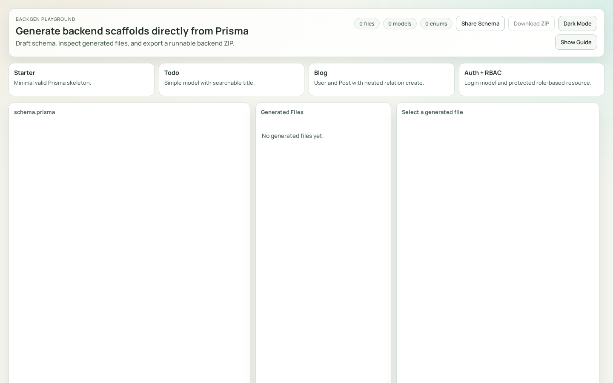
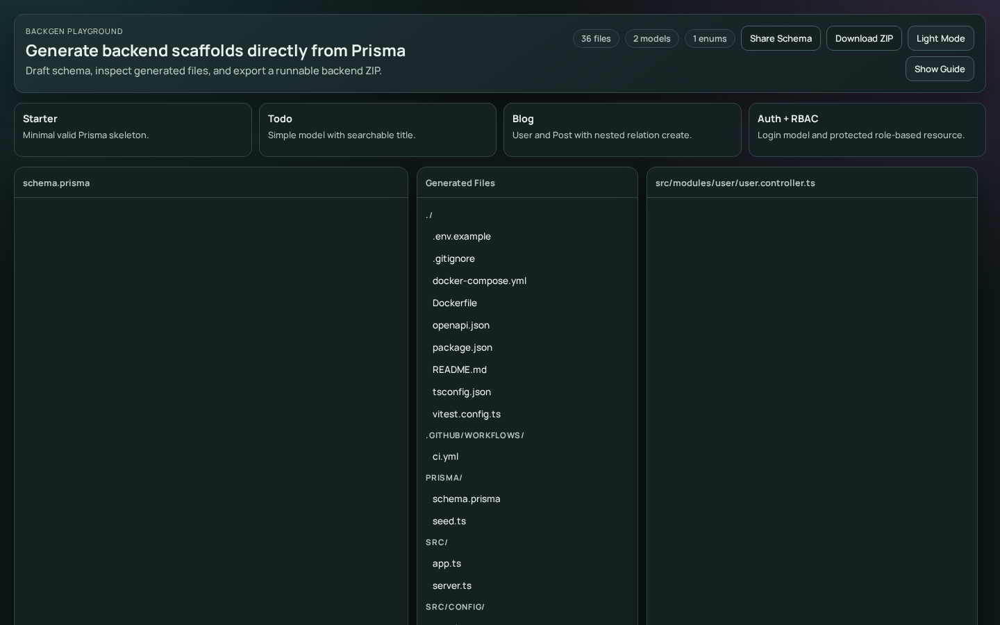
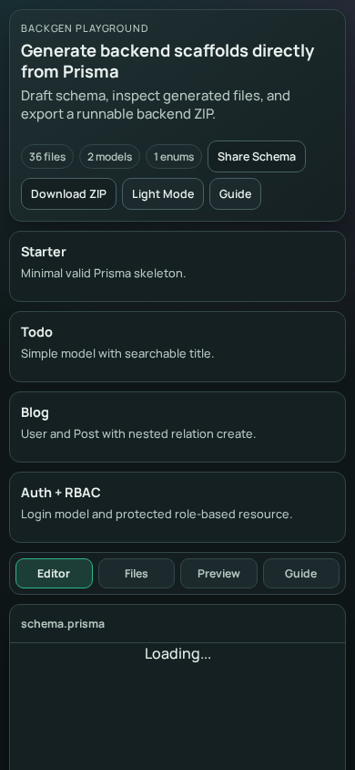

# Backgen

> Prisma-to-Backend code generation tool by **Mahmoud Khedr**.

[](https://github.com/Mahmoud-s-Khedr/backgen/actions/workflows/ci.yml)
[](https://github.com/Mahmoud-s-Khedr/backgen/actions/workflows/playground.yml)
[](LICENSE)
[](package.json)

## Live Demo

- Local monolithic playground: `http://localhost:4173`

## What This Project Solves

When teams start from a Prisma schema, they still spend significant time building repetitive backend scaffolding (CRUD routes, validation, auth wiring, docs, infra templates).

**Backgen** automates that path by generating a structured Express + TypeScript API from Prisma models and `/// @bcm.*` directives.

## Key Engineering Highlights

- Schema parser + directive engine for API behavior control.
- Template-based code generation for controllers/services/routes/DTOs/tests/infra.
- Selector-aware generation (single + composite selectors).
- Nested relation generation with selector-aware connect/create payload support for singular and list relations.
- Fail-fast validation for unsafe schema configurations.
- Hard validation for `@bcm.softDelete` models requiring `deletedAt DateTime?`.
- Generated route tests use mocked Prisma delegates, so `npm test` does not require a live database.
- CLI machine-readable mode (`--json`) for tool integration.
- CLI-backed monolithic playground service for consistent generation behavior.

## Architecture Snapshot

1. **CLI Engine** (`src/cli.ts`, `src/commands/*`)
- Parses schema, validates constraints, generates project files.
- Supports human output and structured JSON output.

2. **Generation Core** (`src/parser/*`, `src/generator/*`, `src/templates/*`)
- Converts Prisma AST + directives into typed Express backend scaffolding.

3. **Web Playground** (`packages/playground`)
- React UI for schema editing and generated file preview.
- Express server executes real CLI (`bcm generate --dry-run --json`) via `/api/generate`.
- Kept as a standalone package rather than an npm workspace.

## Quick Start

### CLI
```bash
npm install -g backend-creator

bcm init my-api
cd my-api
# edit prisma/schema.prisma
bcm generate --schema ./prisma/schema.prisma --output . --force
# conflict-safe partial regeneration:
bcm generate --schema ./prisma/schema.prisma --output . --only routes
```

Notes:
- `@bcm.softDelete` models must declare `deletedAt DateTime?`.
- Generated auth remains JWT access-token based; refresh-token flows are not scaffolded.
- `--only` without `--force` aborts if a targeted file would be overwritten with different content.

### Local Playground (CLI-backed monolith)
```bash
# from repo root
npm ci
npm run build

cd packages/playground
npm ci
npm run dev
```

## Screenshots

### Playground (Light)


### Playground (Dark)


### Playground (Mobile)


## Results & Proof

Evidence-backed signals from this repository:

- Root quality checks:
  - `npm run lint`
  - `npm test`
  - `npm run build`
- Playground checks:
  - `npm --prefix packages/playground run typecheck`
  - `npm --prefix packages/playground run test`
  - `npm --prefix packages/playground run build`
- CLI JSON proof sample:
  - `assets/screenshots/cli-generate-json-sample.txt`
- Example matrix runner:
  - `scripts/run-examples.js`
- Supported providers in generation templates/config:
  - PostgreSQL, MySQL, SQLite, MongoDB

## Portfolio Docs

- [Documentation index](docs/README.md)
- [Case study](docs/portfolio/CASE_STUDY.md)
- [CV bullets](docs/portfolio/CV_BULLETS.md)
- [Deployment blueprint (Render)](docs/portfolio/DEPLOYMENT.md)

## About the Author

**Mahmoud Khedr**

- GitHub: [Mahmoud-s-Khedr](https://github.com/Mahmoud-s-Khedr)

## Arabic Summary (ملخص عربي)

**Backgen** هو مشروع DevTool/Backend Engineering يحول مخطط Prisma إلى Backend جاهز للإنتاج بشكل تلقائي.  
يعتمد على parsing + code generation + validation مع دعم selectors مركبة وnested relations.  
الـ Playground يستخدم نفس CLI الفعلي لضمان الاتساق بين الواجهة والأداة.  
هذا المستودع تم تنظيمه ليكون مناسبًا للـ CV والـ portfolio مع أدلة تشغيل واختبارات ووثائق حالة دراسية.

## License

MIT — see [LICENSE](LICENSE).
