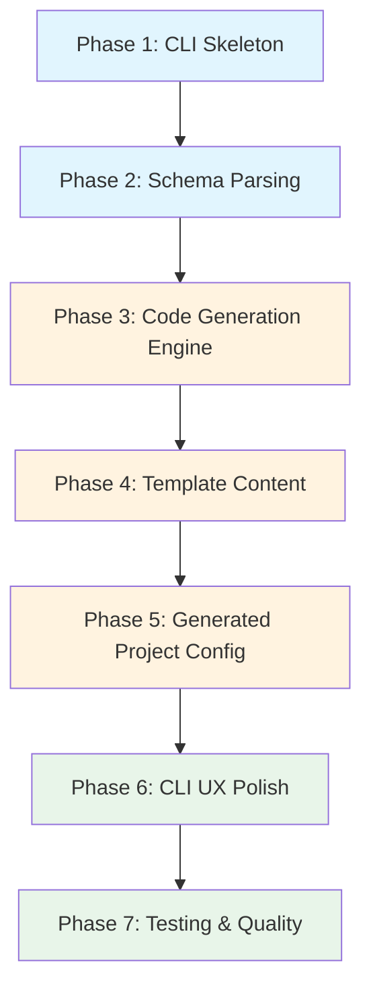

# Backend Creator from Data Model — Implementation Plan

A CLI tool (`bcm`) that generates a complete, production-ready Express.js REST API backend from a standard Prisma schema file. Generate once, eject forever.

> [!IMPORTANT]
> This plan covers the **MVP (v1.0)** scope only. Post-MVP features (`@bcm.searchable`, `@bcm.softDelete`, `@bcm.auth`, `--watch`, etc.) are explicitly excluded.

---

## Phase 1: Project Bootstrapping & CLI Skeleton

Set up the Node.js + TypeScript project and the Commander.js CLI entry point.

### [NEW] [package.json](file:///home/mk/Projects/CV_projects/backgen/package.json)

- `name`: `backend-creator` (or `bcm`)
- `bin`: `{ "bcm": "./dist/generator/cli.js" }`
- Dependencies: `commander`, `ejs`, `chalk`, `ora` (spinner), `fs-extra`
- Dev dependencies: `typescript`, `@types/node`, `@types/ejs`, `@types/fs-extra`, `vitest`, `@vitest/coverage-v8`, `esbuild`
- Scripts: `build` (esbuild bundle + copy templates), `dev`, `test`, `test:coverage`, `lint`

### [NEW] [tsconfig.json](file:///home/mk/Projects/CV_projects/backgen/tsconfig.json)

- Target: `ES2022`, Module: `Node16`
- `outDir`: `./dist`, `rootDir`: `./src`
- Strict mode enabled

### [NEW] [src/cli.ts](file:///home/mk/Projects/CV_projects/backgen/src/cli.ts)

- Commander.js program definition
- Register three commands:
  - `init <project-name>` — scaffold empty project directory with `package.json`, `tsconfig.json`, `prisma/schema.prisma` placeholder
  - `generate` — main generation command with options:
    - `--schema <path>` (required, path to `.prisma` file)
    - `--output <path>` (required, output directory)
    - `--dry-run` (preview files without writing)
    - `--only <part>` (optional: `routes`, `swagger`, etc.)
  - `eject <path>` — strip `/// @bcm.*` comments from generated code
- Wire each command to its handler module

### [NEW] [src/commands/init.ts](file:///home/mk/Projects/CV_projects/backgen/src/commands/init.ts)

- Create project directory structure
- Generate starter `package.json`, `tsconfig.json`, empty `prisma/schema.prisma`
- Print success message with next steps

### [NEW] [src/commands/generate.ts](file:///home/mk/Projects/CV_projects/backgen/src/commands/generate.ts)

- Orchestrator function: parse schema → extract models → apply directives → run generators → write output
- Handle `--dry-run` flag (list files that would be generated, no writes)
- Handle `--only` flag (selective generation)

### [NEW] [src/commands/eject.ts](file:///home/mk/Projects/CV_projects/backgen/src/commands/eject.ts)

- Walk generated files, strip `/// @bcm.*` comment lines
- Add `// Bootstrapped with Backend Creator (bcm)` header comment

---

## Phase 2: Schema Parsing & Directive Extraction

Parse the Prisma schema file and extract model metadata + custom directives.

### [NEW] [src/parser/index.ts](file:///home/mk/Projects/CV_projects/backgen/src/parser/index.ts)

- Exports `parseSchema(schemaPath: string): ParsedSchema`
- Reads schema file, delegates to `parsePrismaAst()` — no fallback logic
- Wraps parse errors with a descriptive message and re-throws

### [NEW] [src/parser/prisma-ast-parser.ts](file:///home/mk/Projects/CV_projects/backgen/src/parser/prisma-ast-parser.ts)

- Sole parser implementation using `@mrleebo/prisma-ast`
- Extracts models, fields, types, relations, enums, datasource config
- Merges `/// @bcm.*` directives from `directive-parser.ts` into the output

### [NEW] [src/parser/directive-parser.ts](file:///home/mk/Projects/CV_projects/backgen/src/parser/directive-parser.ts)

- Regex-based parser for `/// @bcm.*` triple-slash comments
- Extracts field-level directives: `hidden`, `readonly`, `writeOnly`
- Extracts model-level directives: `protected`
- Returns `{ fieldDirectives: Map<modelName, Map<fieldName, FieldDirective[]>>, modelDirectives: Map<modelName, ModelDirective[]> }`
- Validates directive combinations (e.g., `hidden` + `writeOnly` is a conflict → warning)

### [NEW] [src/parser/types.ts](file:///home/mk/Projects/CV_projects/backgen/src/parser/types.ts)

Core type definitions:

```typescript
interface ParsedSchema {
  models: ModelDefinition[];
  enums: EnumDefinition[];
  datasource: DatasourceConfig;
}

interface ModelDefinition {
  name: string;
  fields: FieldDefinition[];
  directives: ModelDirectives;
}

interface FieldDefinition {
  name: string;
  type: string;            // String, Int, DateTime, etc.
  isList: boolean;
  isOptional: boolean;
  isId: boolean;
  isUnique: boolean;
  isRelation: boolean;
  relationModel?: string;
  relationField?: string;
  hasDefault: boolean;
  defaultValue?: any;
  directives: FieldDirective[];
}

type FieldDirective = 'hidden' | 'readonly' | 'writeOnly';

interface EnumDefinition {
  name: string;
  values: string[];
}
```

---

## Phase 3: Code Generation Engine (EJS Templates)

The template engine and all EJS templates for generating the Express.js backend.

### [NEW] [src/generator/index.ts](file:///home/mk/Projects/CV_projects/backgen/src/generator/index.ts)

- `generateProject(schema: ParsedSchema, outputDir: string, options: GenerateOptions): GeneratedFile[]`
- Orchestrates all sub-generators
- Returns list of `{ path, content }` for dry-run or writing

### [NEW] [src/generator/template-engine.ts](file:///home/mk/Projects/CV_projects/backgen/src/generator/template-engine.ts)

- Wraps EJS rendering with common helpers
- Helpers: `toCamelCase`, `toPascalCase`, `toKebabCase`, `pluralize`, `singularize`
- Provides template data context assembly

### [NEW] [src/generator/file-writer.ts](file:///home/mk/Projects/CV_projects/backgen/src/generator/file-writer.ts)

- Takes `GeneratedFile[]` and writes to disk
- Creates directory structure as needed
- Handles `--dry-run` (just prints file list with sizes)

---

### Sub-generators (each generates one category of files):

### [NEW] [src/generator/generators/module-generator.ts](file:///home/mk/Projects/CV_projects/backgen/src/generator/generators/module-generator.ts)

Per model, generates:
- `controller.ts` — route handlers (list, getById, create, update, patch, delete)
- `service.ts` — Prisma CRUD operations with query builder integration
- `routes.ts` — Express router with endpoint definitions
- `dto.ts` — Zod schemas for create, update, patch, and response DTOs
- `test.ts` — Supertest example test file

Directive processing:
- `@bcm.hidden` → field excluded from **create/update/patch** and **response** Zod schemas
- `@bcm.readonly` → field excluded from **create/update/patch** Zod schemas
- `@bcm.writeOnly` → field included in **create/update** schemas, optional in **patch**, excluded from **response** schema
- `@bcm.protected` (model-level) → POST/PUT/PATCH/DELETE routes require `authenticate` JWT middleware; GET routes remain public

### [NEW] [src/generator/generators/config-generator.ts](file:///home/mk/Projects/CV_projects/backgen/src/generator/generators/config-generator.ts)

Generates:
- `src/config/database.ts` — Prisma client singleton
- `src/config/swagger.ts` — OpenAPI/Swagger setup with `swagger-jsdoc` + `swagger-ui-express`
- `src/config/cors.ts` — CORS configuration
- `src/config/logger.ts` — Pino structured logging
- `src/config/env.ts` — Environment variable validation with Zod

### [NEW] [src/generator/generators/middleware-generator.ts](file:///home/mk/Projects/CV_projects/backgen/src/generator/generators/middleware-generator.ts)

Generates:
- `src/middlewares/error.middleware.ts` — RFC 7807 error handler
- `src/middlewares/auth.middleware.ts` — JWT auth scaffold (verify token, extract user)
- `src/middlewares/rate-limit.middleware.ts` — `express-rate-limit` configuration
- `src/middlewares/validation.middleware.ts` — Zod validation middleware factory

### [NEW] [src/generator/generators/utils-generator.ts](file:///home/mk/Projects/CV_projects/backgen/src/generator/generators/utils-generator.ts)

Generates:
- `src/utils/query-builder.ts` — pagination, sorting, filtering from query params → Prisma args
- `src/utils/response.ts` — standard success/error response helpers

### [NEW] [src/generator/generators/app-generator.ts](file:///home/mk/Projects/CV_projects/backgen/src/generator/generators/app-generator.ts)

Generates:
- `src/app.ts` — Express app setup: middleware stack, route mounting, Swagger UI
- `src/server.ts` — HTTP server startup with graceful shutdown

### [NEW] [src/generator/generators/infra-generator.ts](file:///home/mk/Projects/CV_projects/backgen/src/generator/generators/infra-generator.ts)

Generates:
- `Dockerfile` — multi-stage build (builder → runner)
- `docker-compose.yml` — app + PostgreSQL service
- `.github/workflows/ci.yml` — lint, test, build CI pipeline
- `.env.example` — all required env vars with comments
- `.gitignore` — Node.js + Prisma gitignore
- `README.md` — generated project README with setup instructions

### [NEW] [src/generator/generators/prisma-generator.ts](file:///home/mk/Projects/CV_projects/backgen/src/generator/generators/prisma-generator.ts)

Generates:
- `prisma/schema.prisma` — copies original schema (strips `@bcm.*` comments for clean output)
- `prisma/seed.ts` — faker-based seed with topological sort (parents before children); 5 records per model

### [NEW] [src/generator/generators/swagger-generator.ts](file:///home/mk/Projects/CV_projects/backgen/src/generator/generators/swagger-generator.ts)

Generates:
- `openapi.json` — full OpenAPI 3.0 specification from parsed models
- Per-endpoint: path, method, parameters, request body schema, response schemas
- Handles `@bcm.hidden` (excluded from response schemas), `@bcm.writeOnly` (in request, not response)
- Pagination parameters on list endpoints
- Enum values documented inline

---

### EJS Templates

All templates live under `src/templates/`:

### [NEW] [src/templates/](file:///home/mk/Projects/CV_projects/backgen/src/templates/)

```
src/templates/
├── module/
│   ├── controller.ts.ejs
│   ├── service.ts.ejs
│   ├── routes.ts.ejs
│   ├── dto.ts.ejs
│   └── test.ts.ejs
├── config/
│   ├── database.ts.ejs
│   ├── swagger.ts.ejs
│   ├── cors.ts.ejs
│   ├── logger.ts.ejs
│   └── env.ts.ejs
├── middleware/
│   ├── error.middleware.ts.ejs
│   ├── auth.middleware.ts.ejs
│   ├── rate-limit.middleware.ts.ejs
│   └── validation.middleware.ts.ejs
├── utils/
│   ├── query-builder.ts.ejs
│   └── response.ts.ejs
├── infra/
│   ├── Dockerfile.ejs
│   ├── docker-compose.yml.ejs
│   ├── ci.yml.ejs
│   ├── env.example.ejs
│   ├── gitignore.ejs
│   └── README.md.ejs
├── prisma/
│   └── seed.ts.ejs
├── app.ts.ejs
├── server.ts.ejs
├── package.json.ejs
└── tsconfig.json.ejs
```

Each template receives a standardized context object with model data, directive metadata, and helper functions.

---

## Phase 4: Template Content Specification

Detailed behavior for the most critical generated files.

### Controller Template (`controller.ts.ejs`)

Each model controller exports handlers for:

| Handler | Logic |
|---------|-------|
| `list` | Call service with `buildQuery(req.query)` for pagination/filtering/sorting. Include relations if `?include=` present. Return paginated response with `{ data, meta: { page, limit, total, totalPages } }` |
| `getById` | Find by ID with optional relation includes. Return 404 RFC 7807 if not found |
| `create` | Validate body with create DTO (Zod). Call service. Return 201 + created resource (filtered by response DTO) |
| `update` | Validate body with update DTO (Zod, all required non-optional fields). Call service. Return updated resource |
| `patch` | Validate body with patch DTO (Zod, all fields optional). Call service. Return updated resource |
| `delete` | Delete by ID. Return 204 No Content |

### DTO Template (`dto.ts.ejs`)

For each model, generate four Zod schemas:

| Schema | Fields Included | Notes |
|--------|-----------------|-------|
| `Create[Model]Schema` | All non-`@id`, non-`@default`, non-`readonly` fields. Required if not optional in Prisma, optional if `?`. `writeOnly` fields included. | Relations by ID: `authorId: z.string()` |
| `Update[Model]Schema` | Same as Create | Full replacement semantics |
| `Patch[Model]Schema` | Same fields as Create, but ALL wrapped in `.optional()` | Partial update, `writeOnly` optional |
| `[Model]ResponseSchema` | All fields EXCEPT `hidden` and `writeOnly` | What the API returns |

### Query Builder (`query-builder.ts.ejs`)

- Parses `page`, `limit` → Prisma `skip`/`take`
- Parses `sort`, `order` → Prisma `orderBy`
- Parses `filter[field]=value` → Prisma `where` clause
- Parses `include=relation1,relation2` → Prisma `include`
- Default: `page=1`, `limit=20`, `order=desc`
- Validates field names against model schema to prevent injection

### Error Middleware (`error.middleware.ts.ejs`)

- Catches all errors, formats to RFC 7807:
  ```json
  {
    "type": "https://api.example.com/errors/<error-type>",
    "title": "Human readable title",
    "status": 422,
    "detail": "Detailed error message",
    "instance": "/api/users",
    "errors": []
  }
  ```
- Handles Zod validation errors → 422 with field-level error details
- Handles Prisma known errors (unique constraint, not found) → appropriate HTTP codes
- Handles unknown errors → 500 with safe message (no stack leak in production)

### Auth Middleware (`auth.middleware.ts.ejs`)

- JWT verification scaffold using `jsonwebtoken`
- Extracts `Authorization: Bearer <token>` header
- Verifies token with `JWT_SECRET` from env
- Attaches decoded payload to `req.user`
- Exported as `authenticate` middleware — **not applied by default** (users wire it in)
- Includes TODO comments guiding integration

---

## Phase 5: Generated Project Configuration

### Generated `package.json`

Dependencies for the **generated** project:

| Package | Purpose |
|---------|---------|
| `express` | HTTP framework |
| `@prisma/client` | Database ORM |
| `zod` | Runtime validation |
| `jsonwebtoken` | JWT auth |
| `swagger-jsdoc` | OpenAPI spec generation |
| `swagger-ui-express` | Swagger UI |
| `cors` | CORS middleware |
| `express-rate-limit` | Rate limiting |
| `pino` + `pino-http` | Structured logging |
| `dotenv` | Environment variables |
| `helmet` | Security headers |
| `compression` | Response compression (gzip/brotli) |

Dev dependencies: `prisma`, `typescript`, `@types/*`, `tsx` (dev server), `jest`, `supertest`, `@types/jest`, `@types/supertest`, `@faker-js/faker` (seed data)

Scripts: `dev` (`tsx watch src/server.ts`), `build`, `start`, `test`, `migrate`, `seed`, `studio` (`prisma studio`)

---

## Phase 6: CLI UX & Polish

### [MODIFY] [src/cli.ts](file:///home/mk/Projects/CV_projects/backgen/src/cli.ts)

- Add `chalk` colored output for success/error/info messages
- Add `ora` spinner during generation
- Add `--version` flag from `package.json`
- Add helpful error messages for common mistakes:
  - Schema file not found
  - Output directory already exists (prompt to overwrite or use `--force`)
  - Invalid schema syntax (show parser error location)

### [MODIFY] [src/commands/generate.ts](file:///home/mk/Projects/CV_projects/backgen/src/commands/generate.ts)

- Summary output after generation: number of files, models, endpoints
- Suggest next steps: `cd`, `npm install`, `npx prisma migrate dev`, `npm run dev`

---

## Phase 7: Testing & Quality

### [NEW] [tests/parser/](file:///home/mk/Projects/CV_projects/backgen/tests/parser/)

- `directive-parser.test.ts` — unit tests for `/// @bcm.*` parsing
  - Valid directives: `@bcm.hidden`, `@bcm.readonly`, `@bcm.writeOnly`
  - Invalid/unknown directives → warning
  - Conflicting directives → warning
  - No directives → empty array
- `prisma-parser.test.ts` — tests for schema parsing
  - Models, fields, types, relations
  - Enum extraction
  - Optional vs required fields
  - Default values

### [NEW] [tests/generator/](file:///home/mk/Projects/CV_projects/backgen/tests/generator/)

- `dto-generator.test.ts` — verifies correct Zod schema generation
  - Hidden fields excluded from response schema
  - Readonly fields excluded from create/update schemas
  - WriteOnly fields in create/update but not response
  - Optional fields properly wrapped
  - Patch schema: all fields optional
- `module-generator.test.ts` — verifies controller/service/routes generation
- `swagger-generator.test.ts` — verifies OpenAPI spec structure

### [NEW] [tests/integration/](file:///home/mk/Projects/CV_projects/backgen/tests/integration/)

- `generate-command.test.ts` — end-to-end: provide schema → run generate → verify output structure
  - Verify all expected files exist
  - Verify generated TypeScript compiles (`tsc --noEmit`)
  - Verify generated `package.json` has correct dependencies
- `init-command.test.ts` — verify project scaffolding
- `eject-command.test.ts` — verify `@bcm.*` comments stripped, header added
- `dry-run.test.ts` — verify no files written with `--dry-run`

### [NEW] [tests/fixtures/](file:///home/mk/Projects/CV_projects/backgen/tests/fixtures/)

- `basic-schema.prisma` — simple User + Post schema
- `advanced-schema.prisma` — schema with all directive types, enums, multiple relations
- `minimal-schema.prisma` — single model, no relations

---

## Implementation Order



> [!TIP]
> Phases 1–2 can be developed and tested independently before tackling generation. Phase 7 tests should be written alongside each phase (TDD where practical), but the integration tests require Phase 3+ to be in place.

---

## Verification Plan

### Automated Tests

All tests use **Vitest** as the test runner.

```bash
# Run all tests
npm test

# Run with coverage
npm run test:coverage

# Run specific test suite
npx vitest run tests/parser/
npx vitest run tests/generator/
npx vitest run tests/integration/
```

**Unit Tests (parser + generator):**
- Directive parsing correctness (all directive types, edge cases)
- Schema parsing correctness (models, fields, relations, enums)
- DTO schema generation with all directive combinations
- Template rendering produces valid TypeScript

**Integration Tests:**
- Full `bcm generate` pipeline: input schema → output files → verify structure
- Output TypeScript compiles with `tsc --noEmit` (no type errors)
- `--dry-run` flag writes zero files
- `bcm eject` properly strips directives

### Manual Verification

After all phases are complete, run a full end-to-end smoke test:

1. **Create a test schema** using the example from the idea doc (User, Post, Tag with directives)
2. **Run `bcm generate`** and inspect the output directory
3. **`cd` into the output** and run:
   ```bash
   npm install
   npx prisma migrate dev --name init
   npm run dev
   ```
4. **Open `http://localhost:3000/api/docs`** — verify Swagger UI loads with all endpoints
5. **Test CRUD** via Swagger UI or `curl`:
   - POST a User → verify `password` (hidden) not in response
   - GET users → verify pagination, sorting, filtering work
   - PATCH user → verify partial update
   - DELETE user → verify 204 response
6. **Verify RFC 7807 errors** — send invalid body, verify error format
7. **Verify health check** — `GET /health` returns 200

---

## File Summary Table

| Phase | New Files | Key Technology |
|-------|-----------|----------------|
| 1 | 6 | Commander.js, TypeScript project setup |
| 2 | 4 | `@mrleebo/prisma-ast`, regex directive parsing |
| 3 | 10 + ~20 templates | EJS, code generation engine |
| 4 | — (template content) | Zod, Express, Prisma patterns |
| 5 | — (generated config) | npm, Docker, GitHub Actions |
| 6 | — (polish existing) | Chalk, Ora |
| 7 | ~10 test files | Vitest |

**Total: ~50+ files** across the CLI tool and template library.
